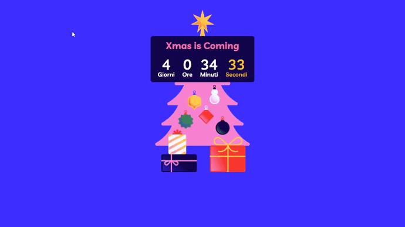

<h1 align="center">XmasCounter</h1>

Contador de dias para Navidad del año 2023

Desarrollado en html ,css, javascript

Desarrollado gracias a las clases de Boolean Code Week

Link de la pagina: http://brayandaga.github.io/XmasCounter/

